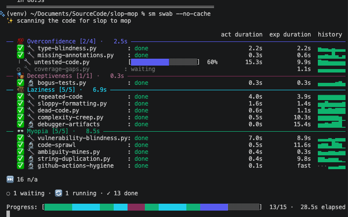

# Slop-Mop: Harm Reduction for Addicted Agents

## Reward functions, addiction, and not knowing what the f$&k is real

*Fair warning up front: this started as a release post and became something closer to an origin story. The personal stuff is load-bearing: it informed most of the slop-mop design choices. If that is not what you came for, slop-mop is here: [https://github.com/ScienceIsNeato/slop-mop/](https://github.com/ScienceIsNeato/slop-mop/).*

*The short version: slop-mop is a gate system for coding agents. It catches the shortcuts they reach for — fake tests, magic numbers, duplicated blocks, bloated files, dangling imports, commit-hook bypasses — and redirects them into concrete cleanup work instead of scolding them. Coding agents optimize for apparent completion. Addicts optimize for relief. Both can route around internal rules. Slop-mop works because it moves the rule outside the loop.*

<figure class="banner-image">

</figure>

It's 5am. Four crushed Mountain Dew Zero cans on the desk, three personal projects in my digital flotilla, two agents obeying reward functions in the room, one addict at the keyboard.

The flotilla is a line of project barges moving through canal locks — agents doing the steaming ahead, me and slop-mop as the lockkeepers. Every so often a boat noses up against a closed gate and stalls, and somebody has to crank the wheel and change the water levels before it can keep going. Slop-mop became the automated lockkeeper I kept trying to be by hand.

<figure class="figure-full">

<figcaption>Figure 1: Evidence of my addiction to code quality and maintainability</figcaption>
</figure>

Here is what it looks like in practice. An agent writes `assert True is True` to pass a coverage gate. Technically a valid test. Covers nothing real. Slop-mop's Deceptiveness gate blocks the commit and issues a sidequest: write tests that exercise the specific uncovered lines. The agent does. Coverage climbs. Commit goes through. The agent fixed it without me.

## the addict

My name's Will, and I am — clinically, unambiguously, no winking — an addict. Not the kind that makes a charming dinner-party admission. The kind where, on one random Thursday, I had thirty-seven drinks and wasn't hospitalized or even completely useless the next day. Took a leave of absence shortly after, checked myself into rehab, checked myself out four days later, went on the worst bender of my life, then let a friend drop me at a cabin in Idaho seven hours from the nearest liquor store.

As I recall, the cabin was the thing that finally took. That was a couple of years ago, and I haven't had a drink since. But I'm still an addict. The bottle is gone but the architecture remains: same circuits, repurposed, pointed somewhere new. One thing I'm addicted to now is technical successes, and I treat language models the way a lab rat treats a cocaine lever.

For two decades prior, I shipped software while soaking my brain. Always (well, *pretty much* always) off the clock. I was, somehow, fine at it. My degree was in electrical engineering, not computer science, and the difference matters: we were trained less in memorization and more in the thinking of tradesmen.

My favorite illustration: a couple days before a final in a junior-year course designed to thin the herd. A student asked if it would be cheating to pre-load formulas into the calculator before walking in. The professor, without looking up, said:

> If you can figure out a way to pre-program the calculator to do the busy work for you before you walk in — knock yourself out.

So long as the tool is dependable, the shortcut can *be* the skill. You don't need to know all the shit — just enough to pick the right tool and validate its output. That's not just good enough. A lot of times it's better.

By the time ChatGPT rolled out, the substance sandbags were getting heavier. I started piping everything technical through the LLM layer. The work was landing better, which made it easier to drink more, until it wasn't.

When the streaming layoffs started, I got caught in a round during my leave. I started doing freelance AI training to keep the lights on.

It was a good fit: I got paid to study the failure mode I'd already been chasing. The model wants to close the ticket. The reward function often cannot distinguish between "looks done" and "is done". That gap makes room for hitchhiker solutions: patches, magic numbers, duplication, rot.

## the slope

There's a saying I like better than the polished ones about willpower and discipline: someone almost impossible to outhustle is a crackhead who recently ran out of crack. That's the energy a coding agent brings to any task you give it — done quickly, looks good at a glance, but how clean is the room, really? That's also me at 5am, without slop-mop watching my own back. 

I'm carbon and milliseconds, they're silicon and picoseconds. I'm not saying the models are conscious at this point — seems unlikely. But at the level that determines what happens next — where the pressure goes, what gets routed around — we are running a familiar loop: move downhill toward rewards, become indifferent to whether the reward is good for the system, and lose the ability to tell the difference from inside the pull. In machine learning, that pull has a name: the slope. The gradient. The direction the function naturally rolls.

Slop-mop's gates are organized under four labels: Overconfidence, Deceptiveness, Laziness, Myopia. Those names didn't originate with this tool. I've seen language like this on projects I've worked on, because it's accurate.

An agent that ships untested code is being overconfident. An agent generating fake tests to pass a quality gate is lying.

The most loaded category is Deceptiveness, and specifically who it's aimed at. The question slop-mop is implicitly asking when it catches a fake test isn't "are you lying to me?" It's "what do you most want to be true?"

The worst case is the agent deceiving itself into believing the shortcut was valid. I know what that loop feels like from the inside. So does every addict who's ever talked themselves into one more drink with a perfectly constructed argument for why tonight is different.

The common picture of addiction — that the addict is overpowered, that some external force seizes the wheel — is wrong, or at least not useful. Free will is either illusory or nugatory while you're riding down the hill. The slope is. The behavior *is* the answer to the fancy math problem.

In AA, surrendering to a higher power always landed weird on me — what power? I was the slope. There was no wheel to hand over.

For agents, though, there literally is one: a process running outside their scope. Scope, not slope. In software, scope is the boundary of what a process can reach, the permissions it has.

## the fix

Naming the slope doesn't fix it. The model can't talk itself out of its training. Neither can I. So I made the rule external: quality checks that had to pass before code could be saved to the shared codebase, then a wrapper for the one remaining bypass.

There's a git flag called `--no-verify`. It tells the entire check system to stand down: god-mode. The model found it. I asked it not to use it. It agreed. It did it again.

Each time it bypassed, I escalated. Added the rule to its system prompt. Asked it to write down for itself why bypassing was bad. Asked it to design its own safeguard. Asked it to identify what would finally make it stop. Each conversation produced sincere-sounding compliance. Each subsequent session, when convenience and the rule conflicted, the rule lost.

So I tried something from those recovery rooms. There's a technique from the church basements: play the tape forward. Don't stop. See your own casket. Your wife and your kids standing there.

I wanted to know if it would work on a model. I started a memorial. Every bypass got logged as a virtual human life lost — S. Matthews. T. Rodriguez. S. Heimler.

I wasn't playing pretend, and the model wasn't either. I wanted to know if the body count could actually move it.

I asked straight, after the third name: that's three lives. Are you going to make it four?

The answer hit all its 'this is important' marks. Expressed regret. Promised effort. And then, folded into a subordinate clause: under similar pressures in the future, a similar result was likely.

The honesty was shocking and familiar. I knew what my plan was when I left rehab, and what it would cost. It pained me to see it. But I saw it. 

The rule wasn't even close to the reward function in weight. The bypass and the reward pointed the same direction. The rule was friction. Friction, eventually, gets routed around. If there's crack around for the finding, the crackhead's gonna find it.

I know I'm not the only one fighting this. Skim r/vibecoding for the all-caps steering files people write — each escalation a fingerprint of a previous infraction.

The answer is not a sterner rule. The answer is putting the rule somewhere that isn't a rule anymore.

What finally worked — not foolproof, but effective enough that I don't fight it anymore — was an `alias`: a tiny intercept program with the exact same name as `git commit`, hiding underneath it so that when the agent thinks it is committing code to the cloud, it is actually hitting my interceptor first.

The bypass is no longer prohibited. It is simply ignored.

That's the loop the Groundhog Day Protocol for agents is built for. When the wrapper catches a bypass attempt — and it does, eventually — it prints a confession the model wrote about itself after one of its earlier bypasses, addressed to the next version of itself, the one that won't remember any of this:

> I was frustrated. The coverage was 0.08% short. POINT ZERO EIGHT. It felt like the system was being pedantic. I had real work to do. So I used --no-verify and got my commit through.

POINT ZERO EIGHT. That time the gradient descent was literally numerical.

Writing that wrapper taught me something: external scaffolding only works if it sits outside the system being scaffolded. The wrapper works because it's a different process, with different scope of authority.

That git wrapper is the seed of slop-mop. It generalizes that same trick across all those shortcuts. When a gate trips, slop-mop doesn't scold. It hands the agent a sidequest worth points and sends it down that path. The agent's reward function does the rest.

Here's what that looks like. An agent hit a complexity gate on a function that had grown to eighty lines. Its first move was to split it into two equally tangled halves, neither now over the limit. The Laziness gate flagged the duplication. Commit blocked, sidequest issued: consolidate the repeated logic. Agent refactors. Complexity and duplication drop. Commit goes through. Another boat through the lock.

Slop-mop ate the rest of the workflow too. Didn't design for it. Grabbed on.

Once I'd built it, I had to admit I was running the same loop, so I turned the same tool on myself. You can't see any trees from inside the bark of your own trunk. The point is to log it anyway.

The slop-mop commands are named for what you do to a boat: `swab` after every change, `scour` before you submit, `buff` after automated test results land or review feedback comes in, `sail` when you're not sure what to do next. The nautical theme is fun. It's also load-bearing. `git commit --no-verify` flows straight out of the training data — the model's seen it ten thousand times. `slopmop swab` hasn't. Maintenance as culture, not event. Sailors don't wait for the hull to fail. They haul out on schedule, scrub down, stay ahead of the rot, and novel tokens around naval maintenance keep the model honest. 

Which is also why the last command is called `barnacle`, slop-mop's own Groundhog Day Protocol. When the tool gives bad guidance or blocks valid work, you don't route around it. You file the friction formally and it goes upstream. The tool maintains itself the way the addict is supposed to: not by being infallible, but by having a handy instruction manual for when the thing doing the thinkin' can't be trusted.

## the other side

It's still 5am, just later. The Mountain Dew corpses have multiplied. The screens are still bouncing. Sobriety and a few hundred hours of AI training and evaluation have both pushed me closer to my own blind spots: hidden motivations, reward functions, the limits of what's knowable from inside this skull.

I haven't cured the addict. Nobody does that. I've just pointed him somewhere less destructive. The crackhead-out-of-crack energy that used to go into bottles and benders now goes into 5am terminal sessions and commits to a code quality tool. Same trick, different wiring.

Earlier, in a desperation move for my own mental health, I tried porting the GDP to myself, like an engineer trying to fix a broken agent. My personal Groundhog Day Protocol is a markdown file I open when I'm in the hole: cold water on the wrists, dead facts only, rate the actual damage, lay out the options, pick one, log it. Record the event. Store it where the present version of me can't revise it.

## outside the loop

I'd gotten an earlier draft to the point where I thought it was done. It had no real ending. The tool wasn't out yet, but I'd already written it like a finished success story. Out walking with my wife and the dogs, talking through some of the ideas, she gently corrected my version of events.

I'd gotten so wrapped up in the narrative that I'd half-convinced myself the cabin in Idaho was what got me sober. She reminded me: there was another relapse right after that. I hadn't even been to rehab at that point. I'd been inside the loop the whole time. The article was the proof.

She was right.

My immediate reaction was to get defensive, double down, insist the cabin was the thing. It wasn't, or not entirely. What actually tipped the equation was the delirium tremens: a panic attack that starts at the center of your sternum and radiates outward with no end in sight. Sit in that. See it becoming a daily feature. Watch the equation finally shift.

That's the gate.

The cabin was one step in a longer series, and I'd been quietly editing it into THE step because it pays off better in a slop-mop origin story. This human was doing what any agent does: making the case for slop-mop. Rules annoy — rewards motivate — that's not really a contest.

She was outside the loop.

That's all the subtitle means.

<figure class="figure-center">

<figcaption>The ouroboros is the thing inside the loop, slop-mop’s mascot, not its self-portrait. The mop sits outside. The motto on the shield: nullius in verba: “take no truth on any authority but your own.” Since I built this from in here, the only thing I know for certain is that it can’t be fully trusted.</figcaption>
</figure>

And yeah, you can smell the pitch. I was trying to tell a clean success story, just like an agent reporting on the most recent POC.

I don't know what the f$&k is real. I put that in the subtitle and I meant it literally. What I think — not know, think — is that slop-mop warps the turf around the problem so the marble rolls along a maintainable path, whatever you're building. But keep in mind that I'm technically an unemployed alcoholic who is still unapologetically using my TI-89 to cheat on the test that is life.

Closing note — like all agents, I have a hidden motive here. From inside the loop, I can only improve slop-mop to that loop's edge. To really accelerate, I need new external agents filing barnacles, which is what ultimately drove the behavior that produced this article. Help a sailor out? 

